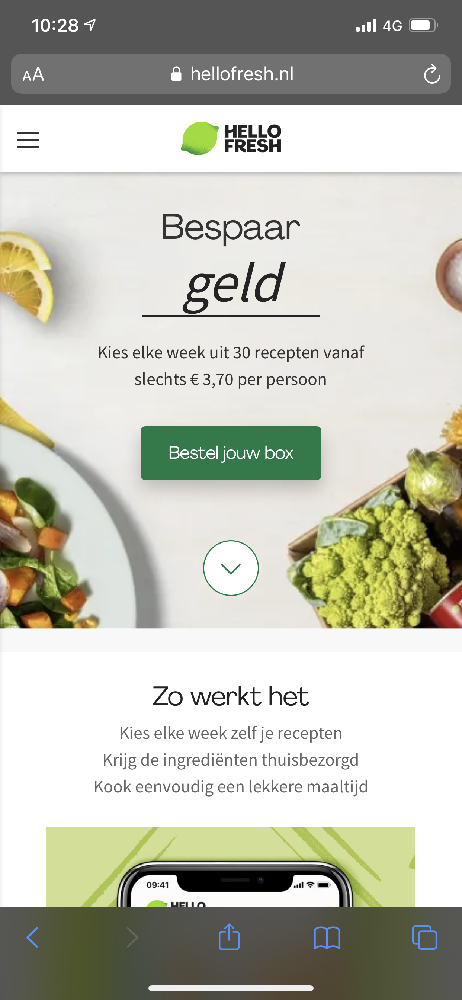
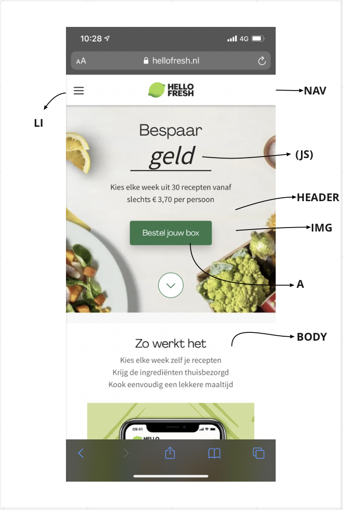
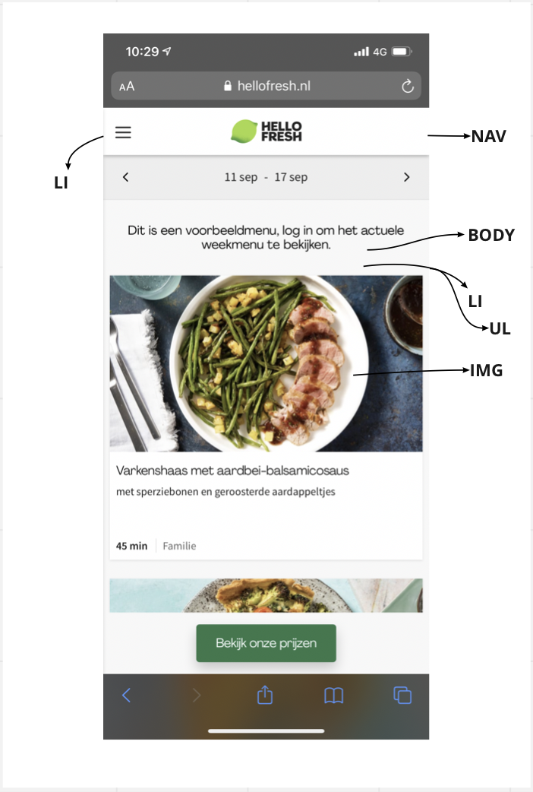
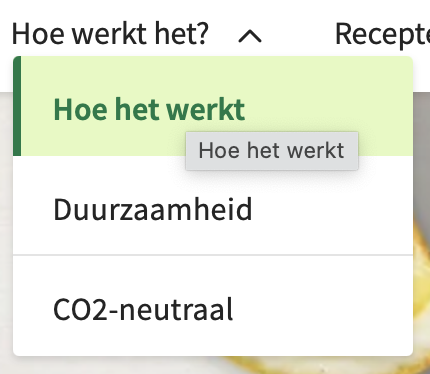
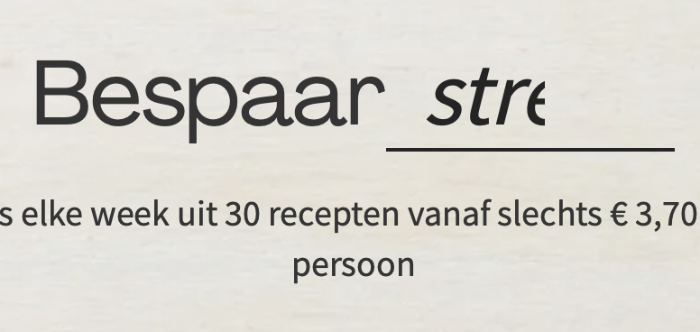

# Procesverslag
Markdown is een simpele manier om HTML te schrijven.  
Markdown cheat cheet: [Hulp bij het schrijven van Markdown](https://github.com/adam-p/markdown-here/wiki/Markdown-Cheatsheet).

Nb. De standaardstructuur en de spartaanse opmaak van de README.md zijn helemaal prima. Het gaat om de inhoud van je procesverslag. Besteedt de tijd voor pracht en praal aan je website.

Nb. Door *open* toe te voegen aan een *details* element kun je deze standaard open zetten. Fijn om dat steeds voor de relevante stuk(ken) te doen.

## Jij

uitwerken voor kick-off werkgroep

### Auteur:
Valerie Ran

#### Je startniveau:
Mijn startniveau is blauw.

#### Je focus:
Surface plane
 

## Je website

uitwerken voor kick-off werkgroep

### Je opdracht:
Ik wil de website van Hello Fresh gebruiken: https://www.hellofresh.nl

#### Screenshot(s) van de eerste pagina (small screen): 

 Hello Fresh start pagina:
 

#### Screenshot(s) van de tweede pagina (small screen):

 Hello Fresh weekemenu: 

 

## Breakdownschets (week 1)

uitwerken na afloop 2e werkgroep

### de hele pagina: 

### dynamisch deel (bijv menu): 

### wellicht nog een dynamisch deel (bijv filter): 

 Op het beginscherm staat een zin waarin het laatste woord na enkele seconde veranderd. Dit is te doen met Java Script. 

## Voortgang 1 (week 2)

uitwerken voor 1e voortgang

### Stand van zaken
Het ging beter en sneller dan ik van te voren had gedacht. Ik ben alleen wat te laat begonnen met mijn website waardoor ik nog niet zo heel ver ben, maar ik heb er wel vertrouwen in! Ik heb het langst gedaan over de button die in het plaatjes moest komen. Dit wilde maar niet lukken dus ik moest weer even research doen naar de opdrachten uit de les en uiteindelijk is het gelukt! 

### Agenda voor meeting
samen met je groepje opstellen

| student 1      | student 2          | student 3    | student 4        |
| ---            | ---                | ---          | ---              |
| dit bespreken  | en dit             | en ik dit    | en dan ik dat    |
| en dat ook nog | dit als er tijd is | nog een punt | dit wil ik zeker |
| ...            | ...                | ...          | ...              |

### Verslag van meeting
hier na afloop snel de uitkomsten van de meeting vastleggen

- punt 1
- punt 2
- nog een punt
- ...

## Voortgang 2 (week 3)

uitwerken voor 2e voortgang

### Stand van zaken
hier dit ging goed & dit was lastig (neem ook screenshots op van delen van je website en code)

### Agenda voor meeting
samen met je groepje opstellen

| student 1      | student 2          | student 3    | student 4        |
| ---            | ---                | ---          | ---              |
| dit bespreken  | en dit             | en ik dit    | en dan ik dat    |
| en dat ook nog | dit als er tijd is | nog een punt | dit wil ik zeker |
| ...            | ...                | ...          | ...              |

### Verslag van meeting
hier na afloop snel de uitkomsten van de meeting vastleggen

- punt 1
- punt 2
- nog een punt
- ...

## Toegankelijkheidstest (week 4)

uitwerken na test in 8e voortgang

### Bevindingen
Lijst met je bevindingen die in de test naar voren kwamen:

#### Titel eerste bevinding
Hier korte omschrijving (met indien nodig een afbeelding)

Hier een omschrijving van hoe het opgelost kan worden (met indien nodig een afbeelding)

#### Titel tweede bevinding. 
Hier korte omschrijving (met indien nodig een afbeelding)

Hier een omschrijving van hoe het opgelost kan worden (met indien nodig een afbeelding)

#### Titel volgende bevinding. 
Hier korte omschrijving (met indien nodig een afbeelding)

Hier een omschrijving van hoe het opgelost kan worden (met indien nodig een afbeelding)

#### Titel nog een bevinding. 
Hier korte omschrijving (met indien nodig een afbeelding)

Hier een omschrijving van hoe het opgelost kan worden (met indien nodig een afbeelding)

## Voortgang 3 (week 4)

uitwerken voor 3e voortgang

### Stand van zaken
hier dit ging goed & dit was lastig (neem ook screenshots op van delen van je website en code)

### Agenda voor meeting
samen met je groepje opstellen

| student 1      | student 2          | student 3    | student 4        |
| ---            | ---                | ---          | ---              |
| dit bespreken  | en dit             | en ik dit    | en dan ik dat    |
| en dat ook nog | dit als er tijd is | nog een punt | dit wil ik zeker |
| ...            | ...                | ...          | ...              |

### Verslag van meeting
hier na afloop snel de uitkomsten van de meeting vastleggen

- punt 1
- punt 2
- nog een punt
- ...

## Eindgesprek (week 5)

uitwerken voor eindgesprek

### Stand van zaken
hier dit ging goed & dit was lastig (neem ook screenshots op van delen van je website en code)

### Screenshot(s)

hier screenshot(s) van je eindresultaat

## Bronnenlijst

continu bijhouden terwijl je werkt

Nb. Wees specifiek ('css-tricks' als bron is bijv. niet specifiek genoeg).

 <ul>
                <li> <a href="http://www.stickpng.com/img/icons-logos-emojis/menu-icons/hamburger-menu-icon">Menu icoon</a> </li>
                <li>  <a href="https://www.hellofresh.nl/">Hello Fresh logo</a> </li> 
                <li> <a href="https://img.hellofresh.com/c_fill,f_auto,fl_lossy,h_410,q_auto,w_380/hellofresh_website/gb/cms/homepage/HF_App_web_landing_page_newbanners_desktop_767x410.jpg">Header</a> </li>   
                <li> <a href="https://img.hellofresh.com/f_auto,fl_lossy,q_auto,w_820/hellofresh_website/be/cms/homepage/image_columns/hiw-1-v2.png"> Eerste foto</a>  </li> 
                <li> <a href="https://img.hellofresh.com/f_auto,fl_lossy,q_auto,w_820/hellofresh_website/be/cms/homepage/image_columns/hiw-2-v2.png"> Tweede foto </a> </li>
                <li> <a href="https://img.hellofresh.com/f_auto,fl_lossy,q_auto,w_820/hellofresh_website/be/cms/homepage/image_columns/hiw-3-v2.png"> Derde foto </a> </li>
                <li> <a href="https://img.hellofresh.com/f_auto,fl_lossy,q_auto,w_820/hellofresh_website/be/cms/homepage/image_columns/hiw-4-v3.png"> Vierde foto </a> </li>
                <li> <a href="https://img.hellofresh.com/f_auto,fl_lossy,q_auto,w_660/hellofresh_website/be/cms/homepage/main_section/desktop_goodforyou-v2.png"> VijfdeZesde foto</a> </li>
            </ul>

